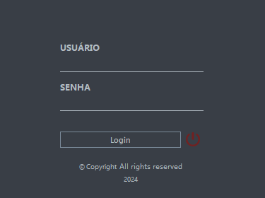
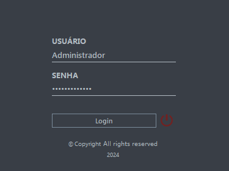

# AppFlix Login Application




## Descrição

O projeto **AppFlix Login Application** é uma aplicação Java que oferece uma interface gráfica para login de usuários, conectando-se a um banco de dados MySQL para validar as credenciais. O projeto foi desenvolvido utilizando o Maven para gerenciar suas dependências e o `mysql-connector-java` para conectar-se ao banco de dados.

## Estrutura do Projeto

A aplicação segue o padrão MVC (Model-View-Controller):

- **View**: Contém a interface gráfica do usuário (GUI) construída com Swing.
- **Controller**: Gerencia a lógica de autenticação.
- **DAO (Data Access Object)**: Responsável pela interação com o banco de dados MySQL.

## Arquivo POM

O arquivo `pom.xml` é utilizado pelo Maven para gerenciar as dependências e configurar plugins para o projeto.

## Instruções de Uso

### Requisitos

- JDK 8 ou superior
- Maven 3.6.3 ou superior
- MySQL 5.7 ou superior

### Configuração do Banco de Dados

1. Instale e configure o MySQL.
2. Crie um banco de dados chamado `appflix_db`.
3. Configure as credenciais do banco de dados no arquivo `ModelConnection.java`:
    ```java
    private static final String USER = "root";
    private static final String PASSWORD = "senha";
    ```

### Compilação e Execução

1. Navegue até o diretório do projeto.
2. Compile o projeto utilizando o Maven:
    ```sh
    mvn clean package
    ```
3. Execute o projeto:
    ```sh
    java -cp target/appflix-database-1.0-SNAPSHOT.jar br.com.appflix.login.view.LoginView
    ```

## Contribuição

Sinta-se à vontade para contribuir com este projeto. Faça um fork do repositório, crie uma branch para sua feature ou correção e envie um pull request.

## Licença

Este projeto está licenciado sob a Licença MIT. Consulte o arquivo [LICENSE](https://github.com/wesleywerikis/appflix-login/blob/main/MIT-LICENSE.txt) para mais informações.
